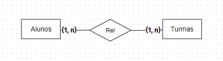

## License

The Laravel framework is open-sourced software licensed under the [MIT license](https://opensource.org/licenses/MIT).

<h2>Sistema de cadastramento de aluno, turma e sala</h2>

Sistema é capaz de gerenciar sala de aula, alocando o aluno na turma e mostrando em qual turma o aluno está, pode fazer a alteração do aluno e a exclusão da alocação do aluno a determina sala.

Assim com entendimento que é para uma escola, de forma que todos os que se cadastrarem, terão acesso aos registros de todos.

De forma que foi feito encima desses requisitos

Desenvolva um sistema em Laravel (Última versão) que atenda a modelagem abaixo. 

Alunos: 
Nome, campo: Obrigatório, 
CPF (o campo CPF não pode se repetir), campo: Obrigatório,
sexo (Masculino ou Feminino), campo: Obrigatório,
data de nascimento (maior que 01/01/1900), campo: Obrigatório,
e-mail (o campo e-mail não pode se repetir), campo: Obrigatório,
renda mensal (Valor monetário maior que zero), campo: Opcional (Não obrigatório). 

Turmas:
Código da turma. Caracteres livre informado pelo usuário, campo: Obrigatório,
Data de Início (maior ou igual a Data Atual), campo: Obrigatório,
Data de Fim (Maior que a data de início da turma), campo: Obrigatório,
Quantidade máxima de alunos na Turma. Número inteiro maior que zero, campo: Obrigatório. Esse campo limita o máximo de alunos que a Turma pode ter.

Para o sistema crie uma tela para os CRUDs de Alunos e Turmas e uma tela onde seja possível informar em qual turma cada aluno está. Cada turma possui um número máximo de alunos que pode receber, o sistema deverá impedir a turma de receber mais alunos que seu limite. Por fim crie uma tela onde podemos ver onde cada aluno está. 
Observação: As telas são de construção livre e o candidato pode escolher o melhor layout.

