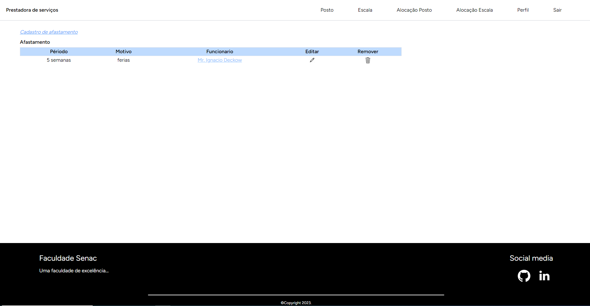
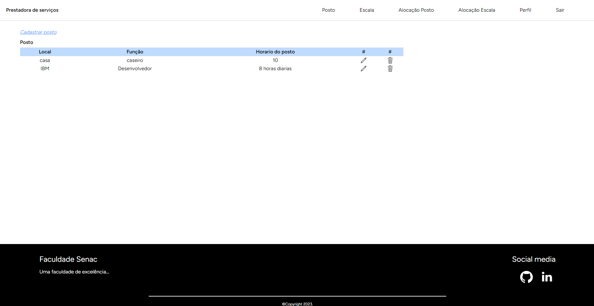
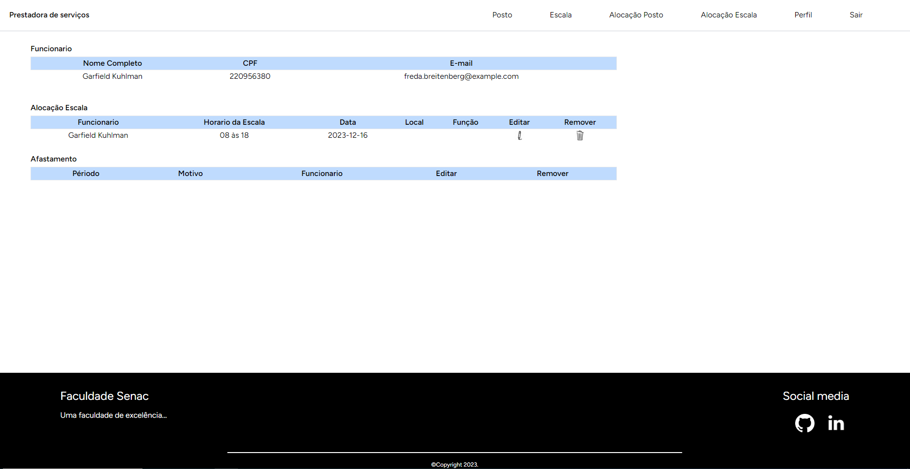

# Gestão Operacional Funcionários

Sistema para fazer gerenciamento operacional de funcionários, onde pode alocar e cadastrar escalas e postos.

## Requisitos Funcionais

### RF01. Cadastro do funcionário

- Informações: será realizado pelo departamento pessoal no ato da contratação.

Regras:

- Cadastro de novos funcionários: realizado pelo RH da empresa; onde será atribuído o seu cargo; o horário; e entre outros.

### RF02. Login

- Informações: permitir que o gestor faça login através do e-mail e senha.

Regras:

- O sistema deve permitir que o administrador informe seu e-mail e informar a senha para logar;
- Se o e-mail ou a senha estiver incorreta exibir erro;
- Botão esqueci a senha, usuário informa o e-mail é enviado uma nova senha para o e-mail informado, administrador poderá fazer a alteração dessa senha.
- Após realizar o login com sucesso, o administrador deve ter acesso às funcionalidades exclusivas de gerenciamento de funcionários, alocação de postos, ausências e outras funcionalidades;
- O administrador deve ter a opção de permanecer logado no sistema por um período determinado de tempo;
- Caso o administrador permaneça inativo por um período de tempo determinado, o sistema deve realizar automaticamente o logout do usuário;
- O sistema deve permitir que o administrador realize o logout a qualquer momento.

### RF03. Cadastro

- Informações: permitir que o gestor faça cadastro para criar a sua conta.

Regras:

- Primeiro acesso como administrador disponibilizar o cadastro da empresa, contendo o nome, e-mail do gestor e senha;
- Se e-mail já cadastrado, exibir mensagem de usuário cadastrado e seguir para tela de login;

### RF04.Gerenciamento de escala trabalho

- Informações: permitir que o usuário (Gestor) da aplicação realize a gestão das escalas de trabalho, cobertura de férias, folgas e ausências legais e verificando a sua atividade, se está ativo ou inativo para a escala;

Regras:

- A aplicação deve permitir que o usuário cadastre novos postos de trabalho.
- A aplicação deve permitir que o usuário (Gestor) aloque os funcionários de acordo com as suas funções e a disponibilidade do posto.
- A aplicação deve permitir que o usuário (Gestor) visualize todos os postos de serviço com seus respectivos colaboradores e escalas de serviço.
- A aplicação deve permitir que o usuário (Gestor) altere a escala de serviço de acordo com a disponibilidade de colaboradores para efetivação do posto ou cobertura.
- A aplicação deve permitir que o usuário (Gestor) filtre os funcionários pela escala de trabalho; pelo posto; por situação da disponibilidade do funcionário.

### RF05. Dashboard

- Informações: permitir que o Gestor visualize o dashboard com informação estatística da escala de serviço.

Regras:

- Permitir que os gestores visualizem o menu completo de forma digital.
- Fornecer tabelas sobre as escalas.
- Será fácil de intuitivo para os gestores usarem, para não se confundirem.

### RF06. Escala de serviço

- Informações: permitir que o gestor faça alteração nas escalas de trabalho ajustando a necessidade operacional.

Regras:

- A aplicação deve permitir que o gestor navegue pelo menu digital para alocamento dos colaboradores conforme necessário;
- O usuário deve ser capaz de visualizar informações detalhadas sobre cada colaborador, incluindo escala, faltas, folga, ausências.
- O gestor deve ser capaz de adicionar ou remover colaboradores a qualquer momento antes de enviar a escala de serviço.

## Arquitetura do Sistema

O sistema utiliza as seguintes tecnologias:

- **Linguagens:** PHP
- **Banco de Dados:** MySQL
- **Frameworks:** Laravel
- **Arquitetura da API:** MVC
- **Outras Tecnologias:** React

### Imagens do sistema

#### A seguir, apresentamos algumas imagens que demonstram as funcionalidades do sistema

- Dashboard

- Posto de trabalho

- Lista de funcionários

